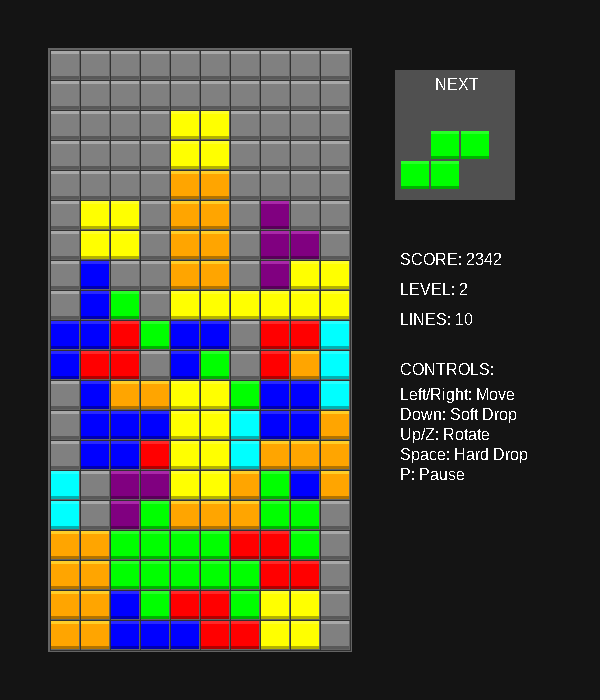
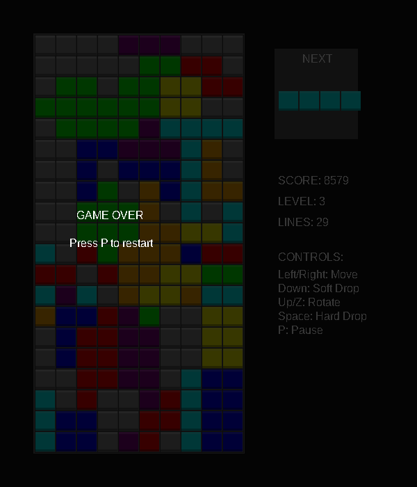

#### Tetris Game in C++ using SDL2 - implemented by Kimi K2.5 via OpenCode Zen Free
- This is mostly just to demonstrate that a an open source and freely hosted model can, indeed create a GUI tetris game in C++.

    - My first attempt did not specify SDL and it worked on the first shot, but was just a terminal app.
- A breakdown of the steps this involved and time time each step took:
- Latest OpenCode with Kimi K2.5 via OpenCode Zen Free
- Create a plan for implementing a tetris game in C++ using SDL2 in this directory
    - 16.3s
- Go for it
    - 2m 32s
- It failed with the following error:
    ```
    /usr/include/c++/15.2.1/bits/stl_vector.h:1263: std::vector<_Tp, _Alloc>::reference std::vector<_Tp, _Alloc>::operator[](size_type) [with _Tp = std::vector<int>; _Alloc = std::allocator<std::vector<int> >; reference = std::vector<int>&; size_type = long unsigned int]: Assertion '__n < this->size()' failed.
    zsh: IOT instruction (core dumped)  ./tetris
    ```
    - 1m 35s
- While the game works, I don't seem to have this font installed, as all of the text is just white boxes. Switch the font to one that is installed on my machine.
    - 2m 11s including time waiting for me to allow it to read my fonts directory
- Working tetris game
- The game works and text is readable, but when I complete a game and attempt to restart, the game crashes with the following error:
    ```
    /usr/include/c++/15.2.1/bits/stl_vector.h:1263: std::vector<_Tp, _Alloc>::reference std::vector<_Tp, _Alloc>::operator[](size_type) [with _Tp = std::vector<int>; _Alloc = std::allocator<std::vector<int> >; reference = std::vector<int>&; size_type = long unsigned int]: Assertion '__n < this->size()' failed.
    zsh: IOT instruction (core dumped)  ./build/tetris
    ```
    - 23.4s




---

## Building

### Prerequisites
- CMake 3.10 or higher
- C++17 compatible compiler
- SDL2
- SDL2_ttf

### Linux

**Install dependencies:**
```bash
# Ubuntu/Debian
sudo apt-get install cmake build-essential libsdl2-dev libsdl2-ttf-dev pkg-config

# Fedora
sudo dnf install cmake gcc-c++ SDL2-devel SDL2_ttf-devel pkgconfig

# Arch Linux
sudo pacman -S cmake base-devel sdl2 sdl2_ttf pkgconf
```

**Build:**
```bash
mkdir build
cd build
cmake ..
make
```

**Run:**
```bash
./tetris
```

### macOS

**Install dependencies (using Homebrew):**
```bash
brew install cmake sdl2 sdl2_ttf pkg-config
```

**Build:**
```bash
mkdir build
cd build
cmake ..
make
```

**Run:**
```bash
./tetris
```

### Windows

**Prerequisites:**
- Install [CMake](https://cmake.org/download/)
- Install [Visual Studio](https://visualstudio.microsoft.com/) with C++ support
- Download SDL2 and SDL2_ttf development libraries from:
  - https://github.com/libsdl-org/SDL/releases
  - https://github.com/libsdl-org/SDL_ttf/releases

**Build (using Visual Studio):**
```powershell
# From the project root
mkdir build
cd build
cmake .. -G "Visual Studio 17 2022"
# Open the generated .sln file in Visual Studio and build
# Or build from command line:
cmake --build . --config Release
```

**Run:**
Copy the SDL2.dll and SDL2_ttf.dll files to the same directory as tetris.exe, then run:
```powershell
.\Release\tetris.exe
```


